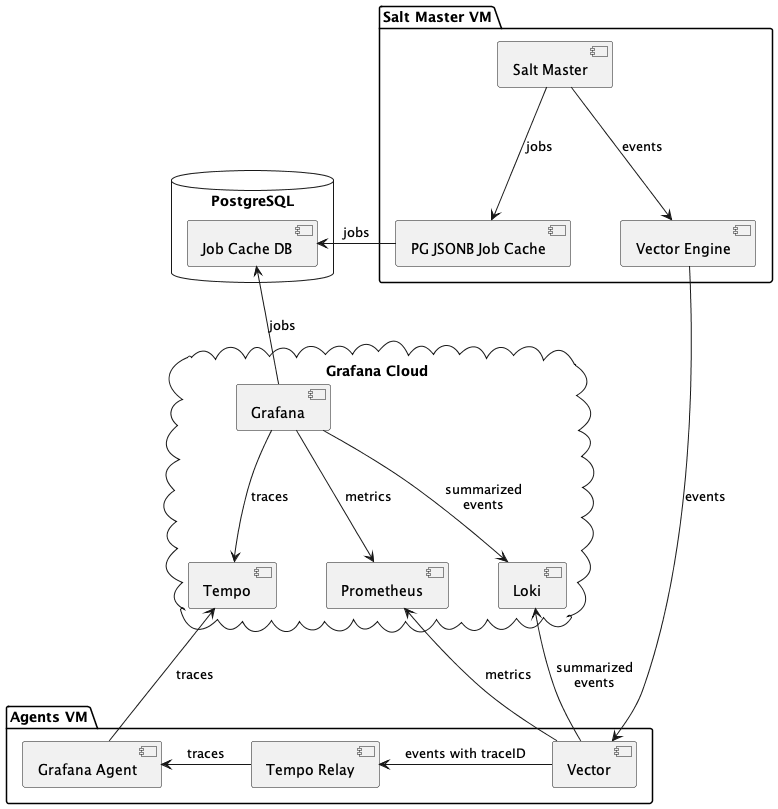
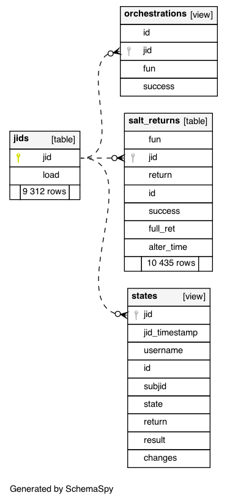
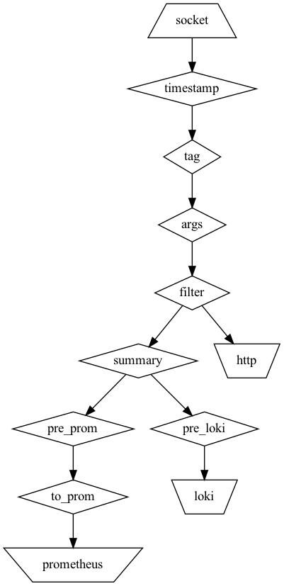

Architecture
============

Guiding principles:

1. Grafana Cloud is used to reduce the amount of infrastructure to maintain. There is nothing that prevents using on-premise Grafana stack (although this wasn't tested)
2. You are encouraged to tweak the default dashboards and panels, add new Vector transformations, metrics and alerts
3. The components are optional and are considered to be building blocks that you can mix and match. You do not have to use PostgreSQL job cache if you can live without the TreeView panel and do not need to ask complex questions that require ad hoc SQL queries. If you do not need to visualize orchestrations as traces, you can drop the Tempo Relay service and Grafana Agent
4. Some questions are easier to answer with SQL queries, some with LogQL
5. Once configured, Salt Master settings don't need to be changed to add a new metric, transformation or log destination. All transforms are done outside of Salt.
6. Salt orchestrations are the primary units of work. For now this means that execution module calls and ``state.apply/highstate`` aren't supported by event transformations and default Grafana dashboards shipped with the project
7. Future iterations might add support for module calls and highstates. We have other interesting ideas once `#62683 <https://github.com/saltstack/salt/issues/62683>`_ is implemented.
8. It might be possible to replace the Tempo Relay service and Grafana Agent with just Vector, once it gets better support of traces (see `#1444 <https://github.com/vectordotdev/vector/issues/1444>`_, `#12029 <https://github.com/vectordotdev/vector/issues/12029>`_ and `#14747 <https://github.com/vectordotdev/vector/issues/14747>`_)
9. PostgreSQL is used because Loki can't store large blobs of data (the limit is `64 kb <https://grafana.com/docs/grafana-cloud/data-configuration/logs/>`_). Salt job returns (esp. for orchestrations) can easily exceed that
10. Although it wasn't tested, the system should support multiple Salt masters (with the exception of a singular Job Cache DB that should be dedicated for each master unless it is a shared cache for HA setup)

How the full system is wired together:

* Salt Master controls one or more minions and runs various orchestration jobs
* JSONB Job Cache (master returner) sends job returns to a PostgreSQL database. The DB schema has two custom views to make ad hoc queries

* Vector Engine sends Salt events to Vector (as JSON over TCP)
* Vector transforms incoming events
   * Injects the traceID field, adds some tags
   * Forwards events to the Tempo Relay service via HTTP
   * Sends summarized job returns (without the nested ``data`` field) to Loki
   * Generates two Prometheus metrics (job duration and job status)

* Tempo Relay service transforms orchestration job returns into traces (using opentelemetry-sdk) and submits them to Grafana Agent
* Grafana Agent sends traces to Grafana Tempo
* Grafana dashboards use all four data sources (Loki, Prometheus, Tempo, PostgreSQL) to display various dashboards and navigate between them
