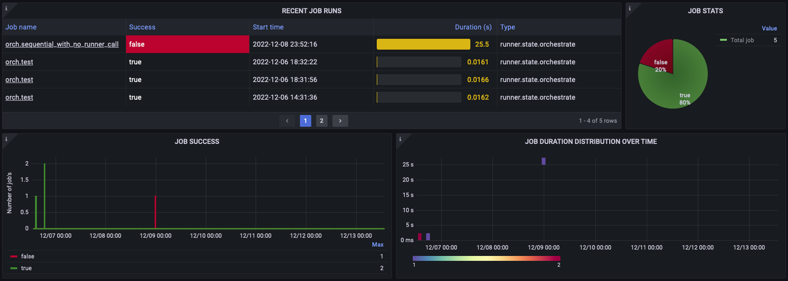
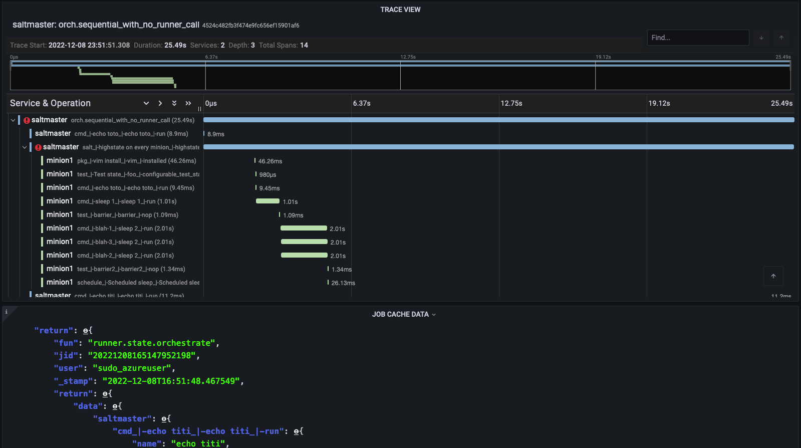

Welcome to Salt Grafana documentation!
======================================

Salt Grafana is an observability platform for Salt masters.

.. toctree::
  :maxdepth: 2
  :caption: Contents:

  architecture.rst
  installation.rst
  operations.rst
  development.rst
  all.rst

Indices and tables
==================

* :ref:`genindex`
* :ref:`modindex`
* :ref:`search`

Licensed under `Apache 2.0 <https://gitlab.com/turtletraction-oss/salt-grafana/-/blob/main/LICENSE>`_

This project was made possible by:

* Erick Alphonse and Nils Martin (`idaaas.com <http://idaaas.com>`_)
* Max Arnold (`salt.tips <https://salt.tips>`_ and `turtletraction.com <https://turtletraction.com>`_)
* Kristoffer Granberg Cauchi (`turtletraction.com <https://turtletraction.com>`_)

See the `AUTHORS <https://gitlab.com/turtletraction-oss/salt-grafana/-/blob/main/AUTHORS>`_ file for a full list of contributors.
