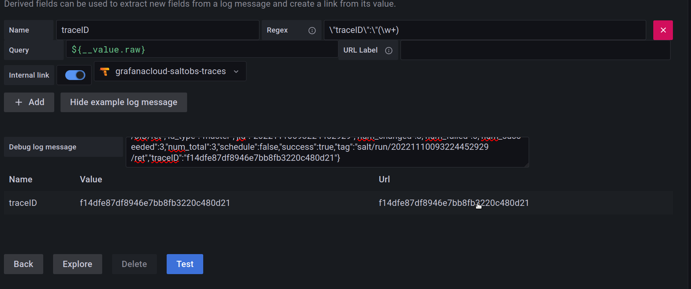

Installation guide
==================

This configuration has been tested on:

* Ubuntu 20.04
* Salt 3005.1

The guide assumes that Salt Master is already installed, and that you use Grafana Cloud (as opposed to on-prem Grafana installation).

The project ships with reference Salt states to help you set up the necessary components. Feel free to tweak them as you want.

Copy the reference Salt states
------------------------------

1. Copy the contents of the `states <https://gitlab.com/turtletraction-oss/salt-grafana/-/tree/main/states>`_ folder into your Salt master's state tree (``/srv/salt/states/``). Later we will define some pillars as well.
2. Copy the `vector.toml <https://gitlab.com/turtletraction-oss/salt-grafana/-/blob/main/vector-engine/etc/vector.toml>`_ to ``/srv/salt/states/vector/``.

Install PostgreSQL and configure it as a job cache
--------------------------------------------------

The Postgres server can be installed on the same machine with Salt master, or on a separate one.

You need two Postgres users: ``salt`` for Salt master with read/write permissions, and ``saltro`` for Grafana Cloud with read-only permissions.

You need to open the 5432 port to the internet, while restricting incoming connections to only allow Grafana Cloud IP addresses. This guide doesn't cover a firewall setup. To get an up-to-date IP list you can query these APIs:

* https://grafana.com/docs/grafana-cloud/reference/allow-list/
* https://grafana.com/api/hosted-grafana/source-ips.txt

It is highly recommended to also enable TLS for PostgreSQL connections: https://www.postgresql.org/docs/current/ssl-tcp.html

WARNING: please use complex passwords for all Postgres users and ensure the server has up-to-date security patches. Even with the above access list, there is still the risk of a malicious Grafana Cloud user trying to guess the passwords and establish an inbound connection. If you prefer not to open Postgres to the internet, you can develop a simple authenticated REST API to look up the necessary data in the PG job cache and expose this API to Grafana Cloud instead of the raw database.

Automated install
^^^^^^^^^^^^^^^^^

1. Install PostgreSQL

.. code-block:: shell

    salt POSTGRES_MINION state.apply postgresql.server

2. Generate PG password hashes

Run the following commands on any Linux machine with Python 3 (replace ``SALTPASSWORD`` and ``SALTROPASSWORD`` with different strong passwords):

.. code-block:: shell

    python3 -c "import hashlib; print('md5' + hashlib.md5(b'SALTPASSWORD' + b'salt').hexdigest());"
    python3 -c "import hashlib; print('md5' + hashlib.md5(b'SALTROPASSWORD' + b'saltro').hexdigest());"

Put the hashed passwords into pillar under the corresponding keys:

* ``postgres_salt_md5password``
* ``postgres_saltro_md5password``

Put the ``salt`` user password in plaintext under the following pillar key:

* ``postgres_salt_password``

3. Create the database and users

Now create the ``salt`` database, the database users, and the necessary tables:

.. code-block:: shell

    salt POSTGRES_MINION state.apply postgresql.db

The reference SQL script is located at https://gitlab.com/turtletraction-oss/salt-grafana/-/blob/main/states/postgresql/files/create_tables.sql

4. Set up PostgreSQL as a job cache for the Salt Master

Add the following pillar key (optional, uses ``127.0.0.1`` by default):

* ``postgres_host``

Then enable the cache and restart the master:

.. code-block:: shell

    salt MASTER_MINION state.apply postgresql.cache

If your PG server supports TLS (the lab one doesn't), add the following lines to ``postgres-cache.conf``:

.. code-block:: yaml

    returner.pgjsonb.sslmode: None
    returner.pgjsonb.sslcert: None
    returner.pgjsonb.sslkey: None
    returner.pgjsonb.sslrootcert: None
    returner.pgjsonb.sslcrl: None

Instead of ``None`` please define the values as described here https://www.postgresql.org/docs/current/libpq-connect.html#LIBPQ-PARAMKEYWORDS

5. Check the cache

Check whether the master uses the job cache by running any job and then querying the ``jids`` SQL table.

Manual install
^^^^^^^^^^^^^^

1. Connect to the PG server and run the sql script (tweak it to adjust the user names):

.. code-block:: shell

    psql "sslmode=require host=postgresql.example.com user=XXX password=XXX dbname=XXX"
    \i states/postgresql/files/create_tables.sql

2. Set up PostgreSQL as a job cache for the Salt master

1. Install Psycopg2 via ``apt install python3-psycopg2`` or ``salt-pip install psycopg2`` for Salt onedir
2. Copy ``states/postgresql/files/postgres-cache.conf`` to your Salt Master ``/etc/salt/master.d/`` directory
3. Replace ``returner.pgjsonb.host`` value with the PG server address
4. Replace ``returner.pgjsonb.user`` with the user name
5. Replace ``returner.pgjsonb.pass`` with the plain-text password
6. Replace ``returner.pgjsonb.db`` with the database name
7. Uncomment the ``returner.pgjsonb.sslmode: require`` line
8. Restart the Salt master and check whether it uses the job cache by running any job and then quering the ``jids`` SQL table

Configure Grafana Cloud
-----------------------

To use the default dashboards shipped with Salt Grafana, you need to configure the following items in Grafana:

* Loki data source
* Prometheus data source
* Tempo data source
* PostgreSQL data source
* Grafana plugins
* Dashboards
* Server-side Grafana Cloud settings

1. Loki data source

1. Go to https://grafana.com
2. Click the right stack
3. Click the ``Details`` section for Loki
4. Note the ``URL``, ``User``, and ``Password`` settings to use them later for Vector install

2. Prometheus data source

1. Go to https://grafana.com
2. Click the right stack
3. Click the ``Details`` section for Prometheus
4. Note the ``Remote Write Endpoint``, ``Username / Instance ID``, and ``Password / API Key`` settings to use them later for Vector install

3. Tempo data source

1. Go to https://grafana.com
2. Click the right stack
3. Click the ``Details`` section for Tempo
4. Locate the "Sending Data to Tempo" section
5. Note the ``endpoint``, ``username``, and ``password`` settings to use them later for Tempo Relay install

4. Add PG data source to Grafana Cloud

Refer to https://grafana.com/docs/grafana/latest/datasources/postgres/ for instructions and make sure to specify the ``saltro`` user credentials for better security:

* Host: ``X.X.X.X:5432``
* Database: ``salt``
* User: ``saltro``
* Password: ``SALTROPASSWORD`` plain text password you defined earlier
* TLS/SSL Mode: depends on your PG server settings

5. Install Grafana plugins

* https://grafana.com/grafana/plugins/pgillich-tree-panel/
* https://grafana.com/grafana/plugins/gapit-htmlgraphics-panel/

6. Import the default dashboards

The dashboards can be found at https://gitlab.com/turtletraction-oss/salt-grafana/-/tree/main/dashboards/default

7. Server-side Grafana Cloud settings

Derived ``traceID`` field:

* Go to https://grafana.com
* Click the right stack
* Launch Grafana
* Go to ``Configuration -> Data sources``
* Choose the Loki data source and scroll down to the ``Derived Field`` section
* Fill in the form as displayed below and make sure to test the regex by pasting a test log line (click on ``Show example log message``):

* Create a support ticket with this content:

    What happened?
        The default derived field for traceID does not work

    What was expected to happen?
        Log to trace button should be visible in each log line that has the traceID field

    How to fix that?
         Modify the default regex

         .. code-block:: shell

             traceID=(\w+)

         with new regex:

         .. code-block:: shell

             "traceID":\s*"(\w+)"

* Once a Grafana support person completes the ticket, make sure to check it by clicking ``Explore``, selecting the ``Loki-datasource`` and adding a query to see all logs. Then when you click on a log line, you should see a button next to the traceID field.
* For more details, visit https://grafana.com/docs/grafana/latest/datasources/loki/configure-loki-data-source/#derived-fields

Trace to metrics:

* Go to https://grafana.com
* Click the right stack
* Launch Grafana
* Go on ``Configuration -> Data sources``
* Choose Tempo datasources and scroll down
* If the ``Trace to metrics`` section is not visible, you need to send a ticket to Grafana support to enable it
* To work correctly, ``Trace to metrics`` needs the metrics generator, to enable it send a ticket to Grafana support
* Now you have to decide which tags you will use, and define a query, and ask support to configure them
* Then you can check the ``Explore`` panel to see if the metrics work as expected
* For more details, visit  https://grafana.com/blog/2022/08/18/new-in-grafana-9.1-trace-to-metrics-allows-users-to-navigate-from-a-trace-span-to-a-selected-data-source/

Install the Vector engine
-------------------------

Automated install
^^^^^^^^^^^^^^^^^

Define the following pillar keys (noted in the Grafana Cloud section):

* ``vector_listen_source`` (``127.0.0.1:9000`` by default)
* ``vector_loki_sink`` (like ``https://loki.example.com``)
* ``vector_loki_user``
* ``vector_loki_pass``
* ``vector_prom_sink`` (like ``https://prom.example.com/api/prom/push``)
* ``vector_prom_user``
* ``vector_prom_pass``
* ``vector_http_sink`` (``http://127.0.0.1:8000/endpoint`` by default, see the Tempo Relay section)

Install the Vector agent (on the same machine as the Salt master or on a separate one):

.. code-block:: shell

    salt VECTOR_MINION state.apply vector.agent

Define the following pillar key:

* ``vector_agent_endpoint`` (``127.0.0.1:9000`` by default)

Install the Vector engine on the Salt master and restart the master:

.. code-block:: shell

    salt MASTER_MINION state.apply vector.engine

Manual install
^^^^^^^^^^^^^^

First, install Vector on the same (or separate) server as the Salt Master: https://vector.dev/docs/setup/installation/

The engine requires the following source to be configured in Vector (see the `full configuration <https://gitlab.com/turtletraction-oss/salt-grafana/-/blob/main/vector-engine/etc/vector.toml>`_):

.. code-block:: toml

    [sources.salt_socket]
    type = "socket"
    address = "127.0.0.1:9000"  # change to 0.0.0.0:9000 if the server is separate from Salt
    mode = "tcp"
    max_length = 102400  # tweak to fit the largest event payload
    decoding.codec = "json"

Second, install the engine on the Salt Master:

For onedir Salt package:

.. code-block:: shell

    salt-pip install saltext.vector

For classic Salt package:

.. code-block:: shell

    pip install saltext.vector

Third, place a snippet like this into ``/etc/salt/master.d/engines.conf`` and restart the master:

.. code-block:: yaml

    engines:
      - vector:
          # host_id: myid  # master or minion id override, optional
          address: "127.0.0.1:9000"  # vector socket endpoing
          # include_tags:
          #   - "*"
          exclude_tags:
            - salt/auth
            - minion_start
            - minion/refresh/*
            - "[0-9][0-9][0-9][0-9][0-9][0-9][0-9][0-9][0-9][0-9][0-9][0-9][0-9][0-9][0-9][0-9][0-9][0-9][0-9][0-9]"

Install the Tempo Relay service
-------------------------------

Define the following pillar keys (noted in the Grafana Cloud section):

* ``grafana_tempo_endpoint`` (like ``example.com:443``)
* ``grafana_tempo_user``
* ``grafana_tempo_pass``

Install the Grafana agent (on the same machine as the Salt master or on a separate one):

.. code-block:: shell

    salt GRAFANA_MINION state.apply grafana.agent

Define the following pillar keys:

* ``tempo_relay_user`` (``root`` by default, but it is strongly recommended to use an unprivileged Linux user)
* ``tempo_relay_endpoint`` (``http://localhost:4317`` by default, should point to your Grafana agent IP address)
* ``tempo_relay_socket`` (``127.0.0.1:8000`` by default, this is where Vector will send the Salt events)

Install the Tempo Relay service (on the same machine as the Salt master or on a separate one):

.. code-block:: shell

    salt GRAFANA_MINION state.apply tempo.relay
