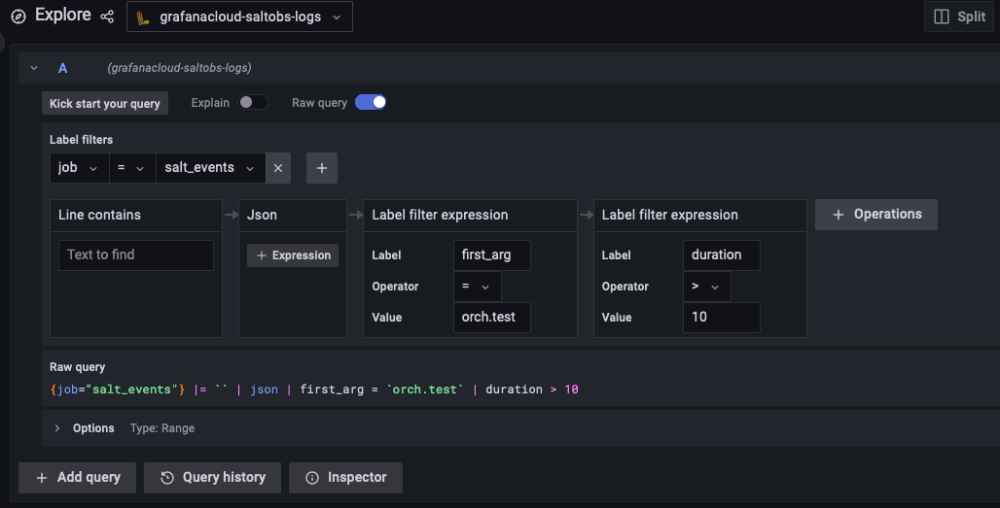

Operations
==========

To answer many operational queries that aren't covered by the default Salt Grafana dashboards, you can use ad hoc queries.

Making ad hoc queries in Grafana Loki
-------------------------------------

To make a query, click ``Explore`` in Grafana, choose a Loki data source and then specify a `LogQL <https://grafana.com/docs/loki/latest/logql/>`_ statement.

.. code-block:: shell

    {job="salt_events"} |= `` | json | first_arg = `orch.test` | duration > 10

Making ad hoc queries in PostgreSQL
-----------------------------------

The main table is ``salt_returns``, but most of the queries will be easier with the ``states`` view. To make a query, click ``Explore`` in Grafana, choose a PostgreSQL data source and then specify an SQL statement. Below are some useful patterns that you can combine together.

1. Time window

To make queries faster, it is always recommended to specify a time window. This can be done either using the ``jid`` column:

.. code-block:: sql

    SELECT * FROM states WHERE jid >= '20221124000000000000';

Alternatively, you can use the derived ``jid_timestamp`` column:

.. code-block:: sql

    SELECT * FROM states WHERE jid_timestamp >= '2022-11-24';
    SELECT * FROM states WHERE jid_timestamp BETWEEN '2022-11-24' AND '2022-11-25';

2. Jobs launched by user

.. code-block:: sql

    SELECT * FROM states WHERE username = 'user';

3. Specific state function

This can answer a question like "which job changed this file" or "which job stopped the service".

.. code-block:: sql

    SELECT * FROM states WHERE state like 'pkg_|%|-installed' and return->>'name' = 'vim';

4. Specific sls file

.. code-block:: sql

    SELECT * FROM states WHERE return->>'__sls__' = 'orch.test';

5. Last job

.. code-block:: sql

    SELECT * FROM states ORDER BY jid DESC LIMIT 1;

6. Jobs that target specific minion

.. code-block:: sql

    SELECT * FROM states WHERE id = 'minion1';

7. By job status

.. code-block:: sql

    SELECT * FROM states WHERE result IS true;

7. Jobs that changed something

.. code-block:: sql

    SELECT * FROM states WHERE changes IS true;

Other useful commands
---------------------

Find all files managed by Salt on a minion:

.. code-block:: shell

    salt minion1 state.show_lowstate --out json | \
      jq -r '.[][] | select(.state == "file") | "\(.name): \(.__sls__)"'

Find which state manages a file:

.. code-block:: shell

    salt minion1 state.show_lowstate --out json | \
      jq '.[][] | select(.state == "file" and .name == "/etc/mailname") | .__sls__'
